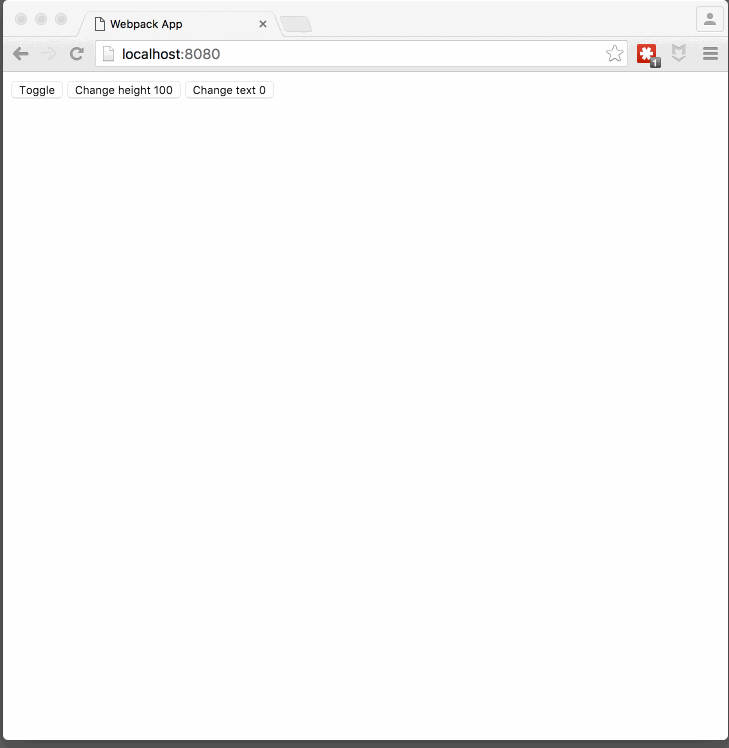

# react-collapse [](https://www.npmjs.com/package/react-collapse)

[](https://gitter.im/nkbt/help)

[](https://circleci.com/gh/nkbt/react-collapse)
[](https://ci.appveyor.com/project/nkbt/react-collapse)
[](https://codecov.io/github/nkbt/react-collapse?branch=master)
[](https://david-dm.org/nkbt/react-collapse)
[](https://david-dm.org/nkbt/react-collapse#info=devDependencies)

Component-wrapper for collapse animation with react-motion for elements with variable (and dynamic) height





## Installation

### NPM

```sh
npm install --save react react-motion react-height react-collapse
```

Don't forget to manually install peer dependencies (`react`, `react-motion`, `react-height`) if you use npm@3.


### Bower:
```sh
bower install --save https://npmcdn.com/react-collapse/bower.zip
```

or in `bower.json`

```json
{
  "dependencies": {
    "react-collapse": "https://npmcdn.com/react-collapse/bower.zip"
  }
}
```

then include as
```html
<script src="bower_components/react/react.js"></script>
<script src="bower_components/react-height/build/react-height.js"></script>
<script src="bower_components/react-motion/build/react-motion.js"></script>
<script src="bower_components/react-collapse/build/react-collapse.js"></script>
```


### 1998 Script Tag:
```html
<script src="https://npmcdn.com/react/dist/react.js"></script>
<script src="https://npmcdn.com/react-height/build/react-height.js"></script>
<script src="https://npmcdn.com/react-motion/build/react-motion.js"></script>
<script src="https://npmcdn.com/react-collapse/build/react-collapse.js"></script>
(Module exposed as `ReactCollapse`)
```


## Demo

[http://nkbt.github.io/react-collapse/example](http://nkbt.github.io/react-collapse/example)

## Codepen demo

[http://codepen.io/nkbt/pen/MarzEg](http://codepen.io/nkbt/pen/MarzEg?editors=101)

## Usage
```js
<Collapse isOpened={true || false}>
  <div>Random content</div>
</Collapse>
```

## Options


#### `isOpened`: PropTypes.boolean.isRequired

Expands or collapses content.


#### `children`: PropTypes.node.isRequired

One or multiple children with static, variable or dynamic height.

```js
<Collapse isOpened={true}>
  <p>Paragraph of text</p>
  <p>Another paragraph is also OK</p>
  <p>Images and any other content are ok too</p>
  
</Collapse>
```


#### `fixedHeight`: PropTypes.number

If content's height is known ahead it is possible to bypass the process of content height calculation by passing optional `fixedHeight` prop with number of pixels.

```js
<Collapse isOpened={true} fixedHeight={100}>
  <div>Animated container will always expand to 100px height</div>
</Collapse>
```


#### `springConfig`: React.PropTypes.objectOf(React.PropTypes.number)

Custom config `{stiffness, damping, precision}` passed to the spring function (see https://github.com/chenglou/react-motion#--spring-val-number-config-springhelperconfig--opaqueconfig)

```js
import {presets} from 'react-motion';

<Collapse isOpened={true} springConfig={presets.wobbly}>
  <div>Wobbly animated container</div>
</Collapse>
```

```js
<Collapse isOpened={true} springConfig={{stiffness: 100, damping: 20}}>
  <div>Customly animated container</div>
</Collapse>
```

#### `keepCollapsedContent`: React.PropTypes.bool (default: `false`)

By default ReactCollapse destroys content of collapsed element. setting `keepCollapsedContent` to `true` allows to keep content. ReactCollapse renders container with `height: 0` and `overflow: hidden` (with all the content untouched) when closed instead of destroying it. See #18 for details.


#### Pass-through props

All other props are applied to a container that is being resized. So it is possible to pass `style` or `className`, for example.

```js
<Collapse isOpened={true}
  style={{width: 200, border: '1px solid red'}}
  className="collapse">

  <div>
    Animated container has red border, 200px width
    and has `class="collapse"`
  </div>
</Collapse>
```


## Behaviour notes

- initially opened Collapse elements will be statically rendered with no animation (see #19)
- it is possible to override `overflow` and `height` styles for Collapse (see #16), and ReactCollapse may behave unexpectedly. Do it only when you definitely know you need it, otherwise, never override `overflow` and `height` styles.


## Development and testing

Currently is being developed and tested with the latest stable `Node 5` on `OSX` and `Windows`.
Should be ok with Node 4, but not guaranteed.

To run example covering all `ReactCollapse` features, use `npm start`, which will compile `src/example/Example.js`

```bash
git clone git@github.com:nkbt/react-collapse.git
cd react-collapse
npm install
npm start

# then
open http://localhost:8080
```

## Tests

```bash
npm test

# to run tests in watch mode for development
npm run test:dev

# to generate test coverage (./reports/coverage)
npm run test:cov
```

## License

MIT
